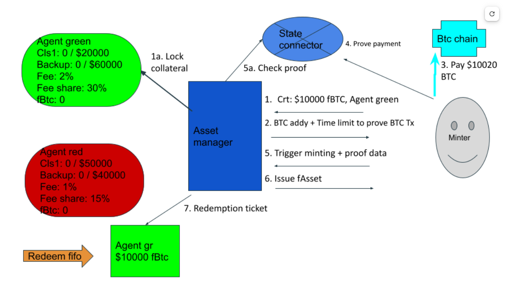
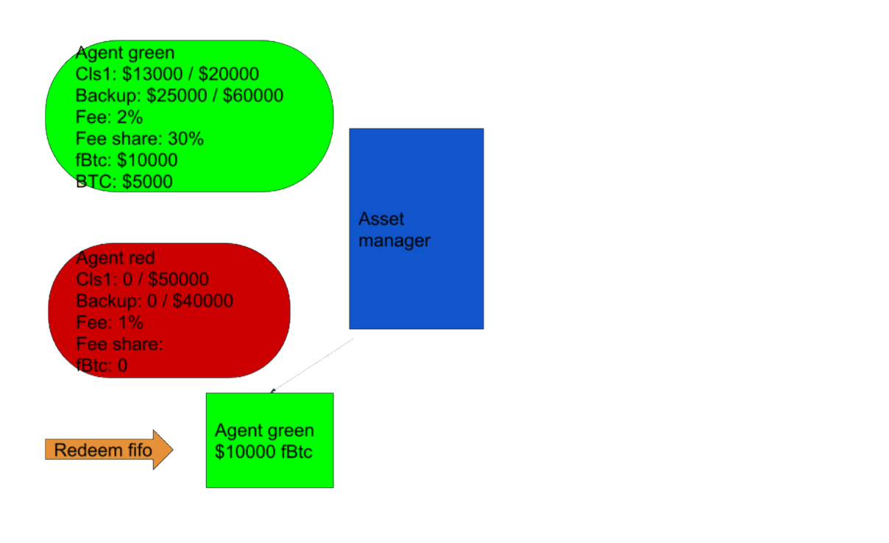

# Minting

## Minting flow

Any user (**minter**) can start the minting operation. Minting flow is as follows:

* The minter picks an agent of their choice from the publicly available agent list. The minter will typically choose the agent based on the minting fee or the amount of free collateral (which must be enough for the minting).
* Minter sends a Collateral Reservation Transaction (CRT) which includes:
  * address of the chosen agent,
  * number of lots to mint (see the documentation for lots below),
  * collateral reservation fee (CRF) to compensate for the locked collateral,
  * optionally an **executor** address which can trigger minting execution once the underlying payment is finalized and proved - this allows a minting UI to execute payment on the users behalf, sparing the user extra operations after finalization time (which can be as long as 1 hour). If the executor is used, the minter should send some more FLR/SGB with the request to compensate the executor (the amount is agreed off-chain).
* The contract will lock the agent's collateral in the amount needed to back the whole minting until the underlying payment is proved or disproved.
* Collateral reservation response is an event issued by the contract which includes:
  * The **agent’s address** to which the minter should send funds on the underlying chain.
  * The **amount** and **fee** to be paid on the underlying chain.
  * **Payment reference** - a unique 32 byte number the minter should include as a memo attached to their  payment on the underlying chain. Each chain has a bit different implementation of a memo field.
  * **Last underlying block and last underlying timestamp to pay.** Payment is valid if it is performed either before the last block (inclusive) or before the last timestamp (inclusive). Time to pay is measured in the underlying chain's blocks / times since the underlying chain might be halting for a long time and then the blocks do not increment on that chain.
* Once the above event is issued, the minter has a limited time to pay the agent on the underlying chain. The minter must deposit the full underlying amount plus the fee.
* The minter or executor proves the payment on Songbird/Flare using the Flare data connector.
* Once the payment was proved, the minter can execute the minting which will send FAssets to their account. This call will credit the minter with the respective number of FAssets.
* When minting is executed, the minting fee is split between the agent and the pool:
  * The agent’s share simply increases the free balance on the agent’s underlying address. Later it can be withdrawn by the agent.
  * The pool share gets minted as FAssets and credited to the collateral pool contract.
* Once minted, the asset manager will create a redemption ticket with the mint amount. See more details below.

## Minting fees

**Collateral Reservation Fee** (CRF) will be paid at the collateral reservation request. This will be used in case the minter doesn't pay on the underlying chain, to compensate the agent and the collateral providers for the time their collateral was locked and waiting for the minting to be completed (correct transaction being proved on the underlying chain). CRF will be paid in the native currency (SGB or FLR) and the amount is defined as a percentage of the minted value, converted to FLR/SGB. For underlying chains where proving a payment takes longer, the fee could be higher. The CRF percentage will be defined by governance and will be the same for all agents.

The amount of the collateral reservation fee can be obtained by calling `collateralReservationFee`. If the amount paid in `reserveCollateral` is more than required, the remainder is the executor’s fee if the minting is executed by an executor, otherwise it is paid back to the user.

At the successful end of the mining or in case of minting payment failure, the CRF is paid to the agent and the pool (in the same share as minting fee).

**Minting Fee** will be paid with the underlying currency and each agent can declare a different fee value. The minting fee is defined by the agent as a percentage of the minted amount.

The minting fee is the main source of revenue for the agent and the collateral providers. Part of the fee is minted as FAssets and given to the pool and the rest is added to the agent’s free underlying balance. The pool fee share percentage is defined by the agent and can be changed by the agent with timelock.

## Minting process diagram

**Explanation**

* Every agent shape contains the following information: vault collateral (used/total), pool collateral (used/total), minting fee, pool fee share and the amount of backed assets.
* Follow the numbered steps to understand the ordering of the steps.
* The relevant settings are: minimal vault CR 1.3, minimal pool CR 2.5, agent’s minting vault CR 1.5, agent’s minting pool CR 3.
* Note that having $13000 of vault collateral isn’t enough for minting, at least $15000 is needed due to minting CR being 1.5. Once the minting is done, only $13000 is needed for backing the minted FAssets. (Analogous for pool collateral.)
* Proving payment step (4) involves a few internal operations:
  * minter sends the attestation request
  * attestation providers attest the payment happened.
  * data is finalised if enough attesters attest with the same data.

### State after minting

## Minting failure

For executing (finalising) the minting, the minter has to prove they successfully paid the agent on the underlying chain. If the payment was not done in the time frame defined by the underlying chain block and timestamp, the agent has to prove non-payment for releasing their collateral. Once non-payment was proven, the Agent’s collateral that was reserved with the CRT call is freed and the agent receives the collateral reservation fee.

Note that the requirement here is to **successfully prove the payment**, meaning it is not enough to complete the payment.

Also for the agent, the requirement is to **successfully** prove non-payment for releasing the reserved collateral.

### Mint failure example

For proving non-payment a special attestation type exists for the Flare data connector - *payment non existence.* See more details in the attestation types repository. See this example which has BTC in mind when considering the block rate and block finality requirements.

* Minter sends a mint request on block 92 - at 09:00 AM.
* Threshold to complete payment is set to:
  * Block 100
  * Timestamp 11:00 AM
* Block 101 is mined with timestamp 10:59 (payment can still happen)
* Block 102 is mined with timestamp 11:04 (once this block is finalised non payment can be proved)
* Block 109 is mined - here we assume 7 blocks on bitcoin are enough to assume finality
* Agent sends a non payment attestation request with relevant payment details - payment reference, required payment amount, last block (100) and last timestamp (11:00).
* Attestation providers attest that block 102 is finalised, has both number and timestamp larger than required, and that until this block the required payment was not done (or was not ok, e.g. the amount was too small).
* Mint payment failure can be submitted to the FAsset system with the above non payment proof.

### Minter must make sure the underlying block is correct

The last time for minter to pay the underlying assets is calculated as the current underlying block/timestamp plus a certain (governance defined) amount of blocks or a certain amount of time - whichever is longer. The problem is, the current block/timestamp as seen by the FAsset system can be quite far in the past, since it cannot be updated automatically by the FAsset contract - it has to be updated by an external call (by presenting a Flare data connector proof of a finalised block).

Usually, the block is updated by various bots and every time the FDC proof  of payment transaction is brought to the asset manager- agent bots also have incentive to update it because the same issue affects redemptions; and there is an independent “timekeeper bot” which can be deployed to update the block every few minutes. However, the minter is still advised to check the current underlying block in the FAsset system and update it if necessary. (The minter can also update the underlying block every time before minting, but that prolongs the time of minting by the time to obtain the Flare data connector proof of the current block, so it’s not necessarily the best strategy.)

## Edge cases

### Unresponsive minter

It can happen that the minter becomes unresponsive after successful payment. In this case, the agent can also present payment proof and execute minting (FAssets are still transferred to the minter's account). In this way the agent's collateral becomes redeemable, otherwise it could remain locked forever.

### Unsticking the minting

For technical reasons the Flare data connector proofs are only available for approximately 14 days. If neither the minter nor the agent present the proof of payment or nonpayment in that time, the minting process gets stuck and the agent’s collateral remains locked indefinitely. This should be an extremely rare event, but it cannot be ruled out so the system has a mechanism to deal with this situation.

The Flare data connector can provide the proof that payments proofs from the time when the deposit should have happened are no longer available. On presenting the proof by the agent, the FAsset system burns the amount of agent’s collateral equivalent to the price of the underlying assets that should be deposited and afterwards the rest of the agent’s and pool’s reserved collateral is released. The collateral is burned because we do not know whether the deposit was made and we don’t want to give any actor advantage by delaying the presentation of payment or nonpayment proofs.

The process of collateral burning is itself a bit complicated - since the agent's collateral is in a form of stablecoin or some other bridged token, we cannot burn it. Therefore the agent has to bring in the equivalent amount of FLR/SGB which is burned and the actual collateral is then transferred to the agent.

In the future there will likely be a method to obtain Flare data connector proofs from any time in the past (perhaps with extra cost). In that case, it will always be better for the agent to present either payment or non-payment proof, so unsticking the minting will not be needed anymore.

## Duration of the minting process

The duration of the minting process depends mainly on the underlying chain speed. Maximum time is the sum of:

1) system defined maximum time for deposit; it is a few underlying blocks or a few minutes (whichever is longer),
2) the chain finalisation time,
3) Flare data connector proof time (3-5 minutes, independent of the underlying chain).

On fast chains like XRP the maximum total time is below 10 minutes. Successful mintings may take less time if the minter pays quickly (only part 1 is shorter), but for payment failures the agent needs to wait the full time before being able to get the non-payment proof.

## Minting payment reference

As stated above, the minter proves their payment as part of the minting process.

We want to make sure the payment transaction can’t be used by another actor who might claim the payment on the underlying chain was done by them, and receive the minted FAssets. We also want to make sure that when the payment time expires and payment hasn’t been performed, the agent can prove that there was no payment for that exact minting.

For handling these issues, a unique payment reference is generated at the collateral reservation request. The minter will have to include the payment reference as a memo field in the underlying payment transaction.

## Self Minting

Self minting involves one actor as both the agent and the minter. After setting up their vault, the agent can state if they want to lend their collateral or only utilise it for self minting. If a vault is limited to self minting, only the agent can mint against their collateral. Self minting can also be done against a vault that was defined as a public vault, but only by the vault's owner.

The flow for self minting is very similar to a normal minting flow, but it is performed in a single step (no collateral reservation request) - the agent first pays on the underlying chain and then executes minting. A self-minting operation adds a ticket to the redemption queue the same way any minting does.

In the self-minting, only the pool’s share of the fee needs to be paid.

Self minting can only be triggered by the vault’s owner address.

Since there is no reservation for self-minting, it could happen that due to some change between the underlying deposit and the execution (another collateral reservation, price change which reduces the amount of free lots, lot size change) the intended number of lots cannot be minted. In this case, the agent can always self-mint a smaller number of lots (including 0 lots) and the remainder of the deposited underlying assets will be added to the free underlying balance.

## Mint from free underlying

An agent that already has some free funds on their underlying address can speed up self-minting by instead using the operation “mint from free underlying”. It is very fast, since there is no need for executing and proving an underlying transaction - it immediately mints the specified number of lots of FAssets, locking the existing free underlying funds and the agent’s collateral. Everything else is the same as for self-mint.

The underlying funds on the agent’s address may be a remainder of some self-close or liquidation. They can also be deposited in advance using the underlying top-up. The advantage of using top-up in advance and then mint-from-free-underlying over using self-mint in advance is that the collateral is not needed at top-up time, but only at minting.

## Redemption tickets and redemption queue

For every minting operation a redemption ticket will be created referencing the minted amount and the agent which is backing this minting. The redemption tickets are ordered in a FIFO queue which will be used when choosing which agent should be redeemed against next.

## Dust

Every minting and redemption must be made in a whole number of lots. However, there are processes that result in generation of fractional number of lots:

1) On minting, part of the minting fee is minted as the FAsset fee to the collateral pool. This value will typically be less than 1 lot.
2) When the lot size is changed, redemptions only close an integer number of lots of each redemption ticket. The remainder is left unredeemed.

In such cases the generated fractional amounts of a lot are not accounted as a redemption ticket, but are accounted separately as “**dust**”. The dust is unredeemable, but it can be destroyed in other ways:

* If the dust exceeds 1 lot, the part that is a whole multiple of a lot can be converted to a redemption ticket by calling a special method. This call can be done by any address, to prevent an inactive agent making FAssets less fungible.
* If the dust exceeds 1 lot during minting, the part that is a whole multiple of a lot will be automatically added to the created redemption ticket.
* The dust can be self-closed at any time.
* Liquidation is not necessarily in a whole number of lots, so it also clears dust.
