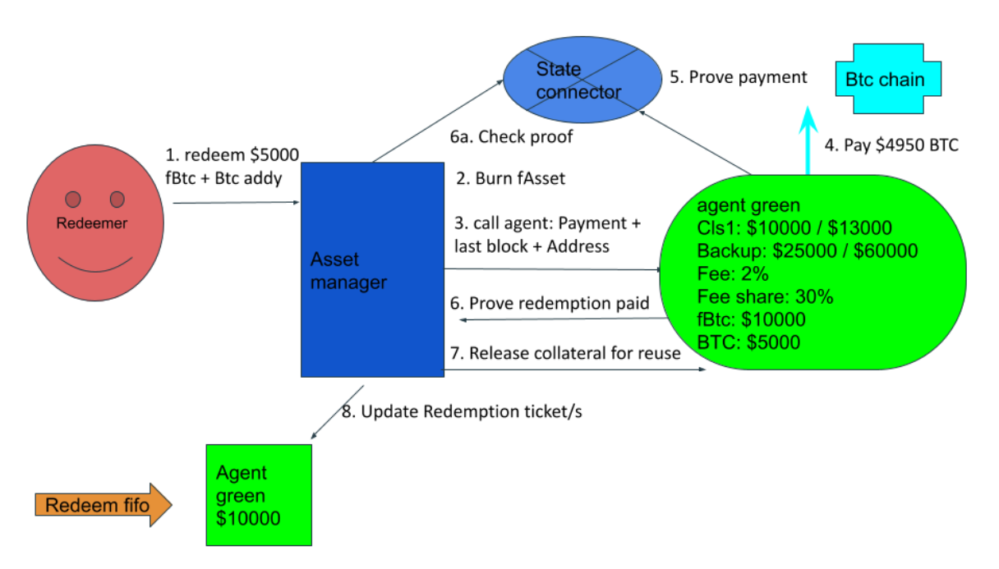

# Redemption

Any user holding FAssets can start a redemption process. The redeemer sends in FAssets and will get paid with the underlying asset. The redeemed amount must be a whole number of lots.

## Redemption flow

1) The redeemer starts the redemption for a whole number of lots (or any amount in case of redeeming with tag).
2) System chooses one or more redemption tickets from the front of the redemption FIFO queue. The number of chosen redemption tickets is capped (to avoid high gas consumption) so if the redemption amount requires too many tickets, only partial redemption will be performed.
3) The system burns FAssets from the redeemer’s account in the amount of the total of the selected redemption tickets. (If there are not enough FAssets on the redeemer’s account, the redemption fails immediately.)
4) For every agent participating in the redemption, the system issues an event with redemption payment information:
   * the redeemer’s underlying address,
   * the amount to pay (the fee is already subtracted)
   * the payment reference (payment reference is different for each agent and each redemption),
   * the last underlying block and the last underlying timestamp to complete the payment,
   * optionally an **executor** address which can trigger redemption default if the agent doesn’t pay in the underlying - this allows a minting UI to execute redemption default on the users behalf, sparing the user extra operations after redemption default time (which can be several hours). If the executor is used, the redeemer should send some FLR/SGB with the request to compensate the executor (the amount is agreed off-chain).
5) Every agent pays the redeemer on the underlying chain with a payment reference included with their payment as a memo field. The agent can pay the redemption from any address - not only the agent’s underlying address.
6) Once payment is performed and finalized, the agent uses the Flare data connector to prove the payment.
7) Once the payment proof is presented to the FAsset system, the agent’s (and pool) collateral that was backing those FAssets is freed.

### Redemption flow diagram

## Redemption failure

The agent has a limited time to make a payment to the redeemer on the underlying chain. The time frame is defined by the last block and the last timestamp on the underlying chain (same as for minting). If the payment was not made, the redeemer has to prove non-payment to receive the collateral. Once the redeemer presents the non-payment proof, they get paid with the agent’s collateral and some premium (e.g. 10%-20%). The premium is there to encourage the agent to complete redemptions using the underlying asset payment and not collateral payment.

### Failure flow

If in the above step (5) one or more agents fail to pay on the underlying chain, the redeemer performs the following procedure separately for each non-paying agent:

1) The redeemer obtains proof of non-payment from the Flare data connector.
2) The redeemer presents the non-payment proofs to the system which triggers redemption failure.
3) Redeemer gets paid with collateral according to the current price and some premium.
4) The remainder of the collateral backing the redeemed FAssets is released.
5) The underlying assets backing the redeemed FAssets are marked as free and can be later withdrawn by the agent.

## Redemption edge cases

### Unresponsive redeemer

It may happen that after a redemption non-payment the redeemer does not or cannot report the failure (for whatever reason). In this case, the agent can present a non-payment proof, which is the same as the redeemer presenting it - the redeemer gets collateral plus premium. The reason why the agent would want to do this is that after this operation, the underlying backing collateral and the remaining local collateral are released.

### Unresponsive agent

Conversely, it may happen that after the successful payment, the agent fails to present the payment proof. This doesn't concern the redeemer (since they already got paid), but the system still needs the payment proof to correctly track the agent's balance on the underlying chain. For this reason **anybody** can present the payment proof after a while (enough time for the agent to present the proof, e.g. 6 hours) and the presenter gets paid some reward in vault collateral from the agent’s vault.

### Expired proof time

When the payment proofs are not available anymore (typically 14 days after the payment should be performed), if there was no payment or non-payment proof presented due to both agent and redeemer being unresponsive, the agent can trigger “finish without payment” procedure. For this, the agent has to present a Flare data connector proof that proofs are not available anymore, which triggers a procedure similar to non-payment - the redeemer is paid in collateral with premium and the rest of the agent’s collateral gets released.

### Redemption time extension

Since an agent vault has only one underlying address, there is some limit on the number of transactions that can be paid per minute. On the other hand, redemption requests to an agent with a large position can arrive from multiple addresses, which is much faster, plus the Flare/Songbird chain is faster than most. Therefore it would be possible to DDOS an agent and force them to miss the redemption payment time, triggering redemption payment defaults and obtaining collateral with premium.

To prevent this, some extra time is added to each redemption when there are many redemptions to the same agent in a short time period. Each simultaneous request adds `redemptionPaymentExtensionSeconds` to the redemption payment time (cumulative). As time passes without new requests, the redemption payment time slowly diminishes back to the default value. The exact formula used is similar to the leaky bucket algorithm used in rate limiters.

The `redemptionPaymentExtensionSeconds` setting is managed separately from other settings by the `RedemptionTimeExtensionFacet` (stored in its own diamond storage slot) and can be changed by governance through the AssetManagerController with rate-limiting constraints.

### Redeemer blocked by the stablecoin operator

If the redeemer is blocked by the stablecoin operator, it may happen that the redemption default payment is impossible in vault collateral. In this case the redeemer is paid in pool collateral, but only under two conditions: the agent must have enough pool tokens that can be slashed and the payment must not push the pool into liquidation.

### Rejecting redemption with invalid address

A malicious redeemer could try to force redemption payment default by providing an invalid target underlying address. In this case, the agent can reject the redemption by presenting an `AddressValidity` proof from the Flare Data Connector showing that the address is invalid. On successful rejection, the redemption is considered fulfilled and the agents collateral is released. This is handled by the `rejectInvalidRedemption` method.

## Redemption fee

The redemption fee is the portion of the underlying asset that is not returned to the redeemer. Part of this fee is retained by the agent, while the rest is minted into fAssets and deposited into the pool. The pool’s share of the redemption fee is the same percentage as it receives during minting.

Imagine the following flow:

1) Agent is minted against: 100 FXRP and gets paid 100 XRP + 2 XRP fee.
2) The Agent withdraws the fee and their address now holds 100 XRP.
3) The agent is redeemed against so they have to pay out 100 XRP.
4) But if they do pay the full 100 XRP, they will have no gas to pay for the transaction. The redemption fee comes to solve this problem. The fee creates a margin between the redeemed amount and the underlying asset value to be paid. This margin allows the agent to cover gas costs, while a portion is converted into fAssets and allocated to the pool.

## Self close

An agent can self close their position or part of their position. This is similar to a redemption, except that there is no underlying payment. The flow is:

1) The Agent sends FAssets to their account.
2) FAssets are burnt.
3) The collateral that was backing those assets is released.
4) Underlying collateral is freed and can be later withdrawn from the underlying address (see underlying withdrawal section below).

Self close can also be used by the agent to stop liquidations, since it reduces the amount of FAssets the agent is backing.

The self-closed amount need not be a whole number of lots and can even be less than one lot. Therefore self-closing is the preferred way to redeem an agent's dust.

## Redeem with tag

This is a small addition to `redeem` functionality that allows redeemer to request that an XRP destination tag is added to the redemption payment.

Unlike ordinary redeem, it also allows redeeming **any amount** of FAssets, not only whole lots. However, to prevent very small redemptions that would cost agents more than the received fee, no redemption can be smaller than `minimumRedeemWithTagAmountUBA` (a system setting).

Since redemption with tag requires a new FDC proof type which supports destination tag and since the redeem amount is not a whole number of lots, there are new methods `redeemWithTag`, `confirmXRPRedemptionPayment`, and `xrpRedemptionPaymentDefault`. A new event `RedemptionWithTagRequested` is emitted on a successful request for redemption with tag.
It only works on XRP chain, so a flag `redeemWithTagSupported` is added that signifies the support.
